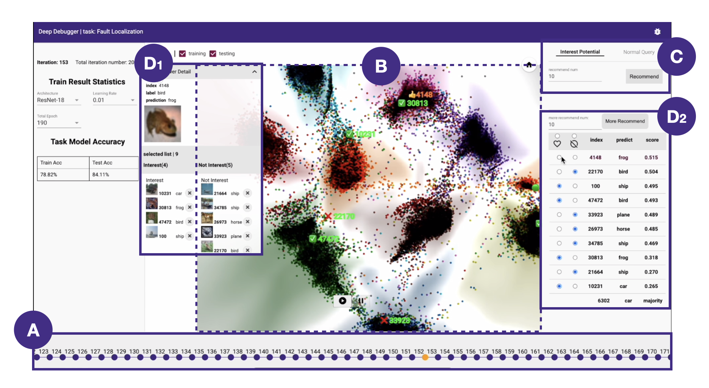

# What is Time-Travelling Visualization?
Time-Travelling Visualization, a technique designed to visualize high-dimensional representations during the deep learning training process. In other words, our method is designed to transform the model training dynamics into an animation of canvas with colorful dots and territories.


# How to Use it?

## Pull Our Code
```
git clone https://github.com/code-philia/time-travelling-visualizer.git
```

The project structure looks as follow:
```
time-travelling-visualizer
│   README.md
|
└───training_dynamic
│   │   README.md
    
│   
└───Vis
|   │   singleVis | ...
|   │   trustvis  | ...
|   │   subject_model_eval.py
|   │   vis_process.py 
|   │   vis_snapshot.py 
|   │   vis_cluster.py
|   │   requirements.txt
|   
│   
└───VisTool
│   │   Backend
│   |   |    ...
│   |   |    server
│   |   |    |   server.py
│   |   |    ...
│   │   Frontend
│   |   |    ...
│   |   |    tensorboard
│   |   |    |   projector | ...
│   |   |    ...
└───
```

- training_dynamic fold is for storing the dataset
- Vis fold is for training the visualization models
- visTool fold is the interactive visualization tool's backend and frontend

⚠️ Note that, the training_dynamic folder stores the training process and the target dataset. 


## Training Process Dataset (the training process of a model)


You can train your classification model and save the training dynamics. For information on the structure of the training dynamics directory and the config file format, refer to the the [dataset's readme document](./training_dynamic/README.md).

🍃 Training dynamics are also available on [Hugging Face](https://huggingface.co/datasets/yvonne1123/training_dynamic) for you to download. 


# Environment Configuration
1. create conda environment
```
$ cd Vis
$ conda create -n visualizer python=3.10
$ (visualizer) conda activate visualizer
```

2. install pyTorch and CUDA
For setting up PyTorch on that conda environment, use the guidelines provided at [PyTorch's official local installation page](https://pytorch.org/get-started/locally/). This guide will help you select the appropriate configuration based on your operating system, package manager, Python version, and CUDA version.

3. install requirements
```
$ (visualizer) pip install -r requirements.txt
```

# evaluate subject model
```
$ (visualizer) python subject_model_eval.py
$ (visualizer) ......

$ (visualizer) Successfully evaluated the subject model, and the results are saved in "your model path"/subject_model_eval.json
```

The trainig dynamic performance(testing accuracy and training accuracy) will be store in /training_dynamic/Model/subject_model_eval.json

# Train Your Time-Travelling Visualizer
- visualize the training process
```
$ cd Vis
$ conda activate visualizer
$ (visualizer) python vis_process.py --start "epoch start number" --end "epoch end number" --content_path "your dataset path"
```
the vis result will be store in /training_dynamic/Vis/***.png
the evaluation resulte wiil be store in "your model path"/vis_eval.json
- visualize the one training snapshots(more precise with little visulization error)
```
$ cd Vis
$ conda activate visualizer
$ (visualizer) python vis_snapshot.py --epoch "epoch number" --end "epoch end number" --content_path "your dataset path"
```
- visualization without prediction sementics
```
$ cd Vis
$ conda activate visualizer
$ (visualizer) python vis_snapshot.py--start "epoch start number" --end "epoch end number" --content_path "your dataset path"
```
# Run Your interactive Visualizer Tool

## Backend
```
$ cd /VisTool/Backend/server
$ conda activate visualizer
$ (visualizer) python server.py
```
you will see: 
```
* Serving Flask app 'server' (lazy loading)
* Environment: production
* Debug mode: off
* Running on http://localhost:5000
```

## Frontend (Option1:Accessing the Built Frontend)
The built version of our frontend interface is stored in the directory /VisTool/Frontend(BUILT). To access it, follow these steps:
1. Navigate to the directory: /VisTool/Frontend(BUILT)
2. Open the file standalone.html in a web browser.
3. Enter the content_path (path to the training dynamic dataset, default is time-travelling-visualizer/training_dynamic) and the backend IP address and port (default is XX.XX.XXX:5000).
4. Click on the 'Login' button to start using the frontend.


## Frontend (Option2: build frontend yourself)

1. Download Bazel from [Bazel's official website](https://bazel.build/install) (version 3.2.0 recommended).
2. Verify the successful installation of Bazel by checking its version:
```
> bazel version
3.2.0
```
3. To run the frontend, use the following commands:
```
cd /VisTool/Frontend
bazel run tensorboard/projector:standalone
```
and you can see:
```
Closure Rules WebfilesServer
Listening on: http://XXX.XX.XXX:6006/
```
4. Access the frontend by opening http://XXX.XX.XXX:6006/ in your web browser.
5. Enter the content_path (path to the training dynamic dataset, default is time-travelling-visualizer/training_dynamic) and the backend IP address and port (default is XX.XX.XXX:5000).
6. Click on the 'Login' button to start using the frontend.

## Acknowledgement
😊 Note: We appreciate [Yang Xianglin's](https://github.com/xianglinyang) contribution from [paper 1](#paper1-ref) for the tool's backend part: [DeepDebugger](https://github.com/xianglinyang/DeepDebugger), which we have integrated into our code.

---

<a name="paper1-ref"></a>[1] Xianglin Yang, Yun Lin, Yifan Zhang, Linpeng Huang, Jin Song Dong, Hong Mei. DeepDebugger: An Interactive Time-Travelling Debugging Approach for Deep Classifiers. ESEC/FSE 2023.

# Citation
Please consider  citing the following paper if you find this work useful for your research:
```
@inproceedings{
},
@inproceedings{yang2022temporality,
  title={Temporality Spatialization: A Scalable and Faithful Time-Travelling Visualization for Deep Classifier Training},
  author={Yang, Xianglin and Lin, Yun and Liu, Ruofan and Dong, Jin Song},
  booktitle = {Proceedings of the Thirty-First International Joint Conference on Artificial Intelligence, {IJCAI-22}},
  year={2022}
},
@inproceedings{yang2022deepvisualinsight,
  title={DeepVisualInsight: Time-Travelling Visualization for Spatio-Temporal Causality of Deep Classification Training},
  author={Yang, Xianglin and Lin, Yun and Liu, Ruofan and He, Zhenfeng and Wang, Chao and Dong, Jin Song and Mei, Hong},
  booktitle = {The Thirty-Sixth AAAI Conference on Artificial Intelligence (AAAI)},
  year={2022}
}
```
