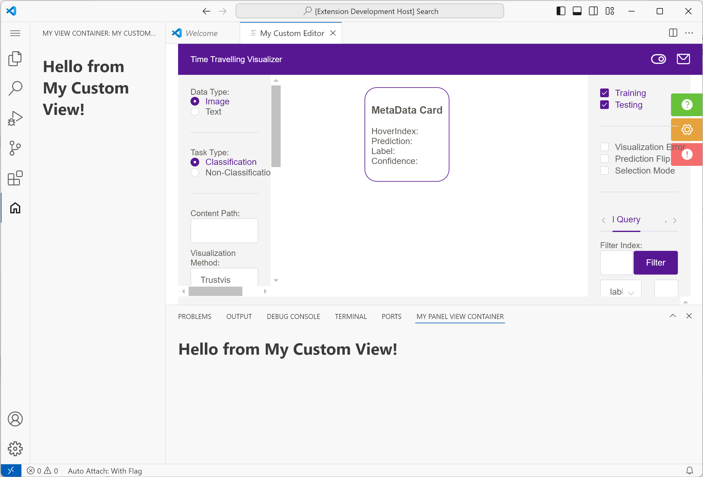

#  VS Code Extension for Time Travelling Visualizer

## Features

> 🏗️ The extension is still in construction...

This is still a demo, showing its feature in 2 ways:

1. Use `Ctrl + P` in VS Code to look for a command called "Call an Editor". Execute it to see how the pure front-end of visualize is displayed using a webview.
2. See on the left side bar of VS Code, and there is a new view container with the logo of a house, displaying a new customized webview.
3. See in the panel on the lower part of VS Code, and there is a new view container, also displaying a new customized webview.

## Development: How to run this extension from scratch?

> We would have assumed experienced front-end developers with decent VS Code knowledge to join this project, but usally young contributor are invited.
> Thus, a more comprehensive guide is written to lead junior developers before they could be pro.

The following guide pre-assumes :

1. Basic programming and environment setting up experience
2. Knowing how to use Git, VS Code and Node.js

### Tools

+ **Terminal:** Any pre-installed terminals and shells on your system should probably be compatible.
+ **VS Code:** Go to [VS Code official website](https://code.visualstudio.com/) and download the latest version of Visual Studio Code.
+ **Git:** [Git Downloads](https://git-scm.com/downloads)
+ **Node.js:** [Node.js official website](https://nodejs.org/)

> After installing Git and Node.js, if you use *VS Code terminal on Windows*, rememeber to close all VS Code windows (not just reloading them) and open them again to make sure new PATH environment variables are loaded.

### Get the project

Using HTTPS to clone project is more convenient. Run this in the terminal:

```shell
git clone https://github.com/code-philia/time-travelling-visualizer.git
```

### Open it using VS Code

Open the project folder `time-travelling-visualizer` **as the workspace folder** in VS Code. Three ways to do this:

+ Open VS Code, drag the project folder into the window or choose `File -> Open Folder...` in the menu
+ Open the terminal, `cd` to the project folder, and run `code .`
+ Right click the project folder and choose `Open in VS Code`, only if you have enable the context menu option when installing on Windows

> Some advanced users may open their whole personal folder for development as the workspace folder, but on development of this project you would more like to set the `time-travelling-visualizer` project folder as the workspace folder, so that the `.vscode` and `.git` directories in the project could be recognized by VS Code. If not, please merge `launch.json` and `tasks.json` into your workspace folder's `.vscode` directory change to paths in them to the relative path from your workspace folder.
>
> ```json
> // launch.json
> ...
> "args": [
>    "--extensionDevelopmentPath=<your-own-relative-path-to-extension-folder>",
>    "--disable-extensions",
> ],
> "outFiles": [
>    "<your-own-relative-path-to-extension-folder>/out/**/*.js"
> ],
> ...
>
> // tasks.json
> "path": "<your-own-relative-path-to-extension-folder>",
> ```

### Switch to extension development branch

We suggest to use the terminal embedded in VS Code, which is launched from your workspace folder. `Ctrl+~` to open the terminal.

```shell
git checkout extension
```

To confirm your success, make sure `<project-folder>/.vscode` contains `launch.json` and `tasks.json` files, and `<project-folder>/extension` contains a VS Code extension with `src` folder, `package.json` and other configuration files.

### Install dependencies

In the terminal, go to the `extension` folder install Node.js modules:

```shell
cd extension
npm install
```

### Run the extension

In the *Run and Debug* tab  on the left activity bar of vscode, choose *Run Extension* option of launch  , then press the button to launch an Extension Host window.

If succeeded, you should

+ see a new view container in the *left activity bar* and a new view container in the *lower panel* of VS Code. If not seeing the panel, toggle it  on the top left of the window.
+ `Ctrl+Shift+P` to search for the command "Call an Editor" and execute it to see customized editor containing the webview.

The UI is as shown below.



## Known Issues

> 🏗️ The extension is still in construction...

## Release Notes

> 🏗️ The extension is still in construction...
